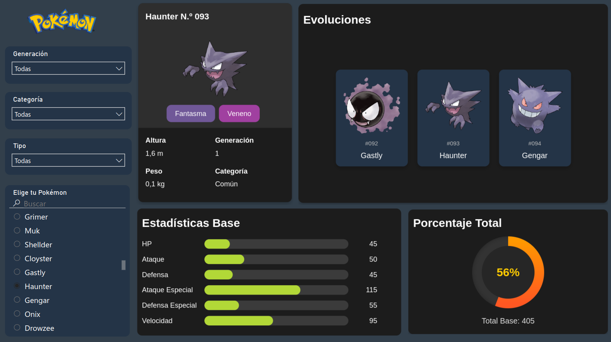

# Pokémon Dashboard en Power BI

¡Bienvenido a mi proyecto de Dashboard de Pokémon en Power BI! Este proyecto utiliza datos extraídos de la PokeAPI para crear un dashboard interactivo que permite visualizar información sobre diferentes Pokémon.



## Contenidos

- [Descripción del Proyecto](#descripción-del-proyecto)
- [Instalación](#instalación)
- [Uso](#uso)
- [Fuentes de Datos](#fuentes-de-datos)
- [Scripts de Extracción de Datos](#scripts-de-extracción-de-datos)
- [Contribuciones](#contribuciones)
- [Contacto](#contacto)

## Descripción del Proyecto

Este proyecto fue creado para explorar mis habilidades en Power BI, DAX, HTML y CSS. Utiliza datos de Pokémon extraídos mediante la PokeAPI con Python y presenta un dashboard interactivo que muestra estadísticas, evoluciones y otros detalles de cada Pokémon.

## Instalación

Para ejecutar este proyecto localmente, sigue los siguientes pasos:

1. Clona este repositorio:
   
   ```bash
   git clone https://github.com/injantedataweb/pokemon-dashboard.git
   
## Uso

Una vez que el dashboard esté abierto en Power BI, podrás:
- Ver estadísticas base de cada Pokémon, como HP, ataque, defensa, ataque especial, defensa especial, velocidad y el total.
- Ver el peso (kg) y la altura (m) de cada Pokémon.
- Explorar las cadenas de evolución de los Pokémon.
- Filtrar Pokémon por generación, categoría y tipo.

## Fuentes de Datos

Este proyecto utiliza datos extraídos de la [PokeAPI](https://pokeapi.co/), una API gratuita que proporciona información detallada sobre los Pokémon.

## Scripts de Extracción de Datos

- **extract_base.py**: Este script se encarga de extraer la información básica de cada Pokémon y genera un archivo CSV (pokemon_base.csv). El archivo contiene el identificador, el nombre, el tipo primario, el tipo secundario, enlace de la imagen, las estadísticas base, el peso, la altura y combinación de tipos de cada Pokémon.
- **extract_evolution.py**: Este script obtiene la información evolutiva de cada Pokémon y genera un archivo CSV (pokemon_evolution.csv). Incluye el nombre del Pokémon, su grupo de evolución y la fase de evolución. Este archivo se utiliza para mostrar las cadenas evolutivas en el dashboard de Power BI.
- **extract_types.py**: Este script extrae información sobre los tipos de Pokémon y genera un archivo CSV (pokemon_types.csv). El archivo contiene datos sobre cada Pokémon, separando su tipo primario y secundario en filas independientes, con su combinación de tipos. Esto permite filtrar y visualizar Pokémon que poseen un tipo particular, ya sea como tipo primario o secundario, en el dashboard de Power BI.

## Contribuciones

Las contribuciones son bienvenidas. Si deseas contribuir, siéntete libre de abrir un issue o un pull request en este repositorio.

## Contacto

- **LinkedIn:** [Carlos Injante](https://www.linkedin.com/in/20ismael1999/)

¡Gracias por visitar mi proyecto!
